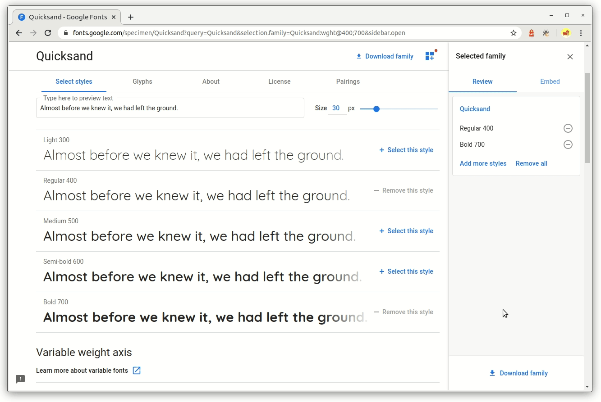

## Menggunakan Font dari Google Font

CSS memiliki fitur yang digunakan untuk memasukkan *font external* ke dalam CSS, yakni menggunakan `@font-face`. Berikut contoh penulisan `@font-face` pada CSS:

```css
@font-face {
    font-family: "Dicoding Font";
    src: url('FILE-FONT.TTF');
}
```

Kode tersebut berfungsi untuk mendefinisikan custom font, dengan nama *“Dicoding Font”*. Ketika mendefinisikan custom font, kita juga membutuhkan berkas font, bisa dilihat berkas font pada contoh adalah *‘FILE-FONT.TTF”*.

Setelah mendefinisikan *font-face*, maka *font-family* dengan nama *“Dicoding Font”* siap diterapkan pada elemen HTML.

```css
p {
    font-family: "Dicoding Font";
}
```

Pada kelas ini kita tidak akan membahas secara detail mengenai `@font-face`. Jika ingin mempelajarinya, Anda bisa mengunjungi dokumentasi Mozilla pada tautan berikut: [@font-face](https://developer.mozilla.org/en-US/docs/Web/CSS/@font-face). Mengapa kita tak mempelajari hal ini secara detail? Karena sekarang terdapat cara yang lebih mudah dan sering digunakan oleh web developer, yakni menggunakan font dari Google Font.

Google Font, layanan Google untuk memudahkan kita mendesain font pada website. Google Font banyak menyediakan tipe font gratis yang dapat kita manfaatkan. Saat materi ini ditulis, Google Font memiliki jenis font sekitar 1.364.

>Perlu jadi catatan bahwa Google Font hanya dapat digunakan ketika komputer dalam keadaan online. Jika kita sedang mengembangkan website dalam keadaan offline, sebaiknya gunakan pendekatan @font-face.

Untuk menggunakan font yang disediakan Google Font, langkah awal yaitu mengunjungi website google font pada tautan berikut: [Google-Font](https://fonts.google.com/).

Sebagai contoh disini kita menggunakan font **Quicksand**. Cari daftar fontnya pada kolom pencarian, setelah ketemu nanti akan tampil halaman seperti dibawah ini:


Tekan tombol *“+ Select this style”* untuk memilih font dengan ukuran yang diinginkan. Di sini kita contohkan dengan memilih font ukuran *Regular 400*. Ketika menekan tombol tersebut, Google Font akan menyimpannya sebagai *selected families* (pilih tombol pada pojok kanan atas untuk melihat *selected families*).

Kita juga bisa memilih ketebalan fontnya. Yuk, pilih juga versi tebalnya *(Bold 700)* dan masukan kembali ke dalam collection.


Setelah selesai memilih font yang dicari, maka tampilan dari *selected families* akan tampak seperti ini:


Selanjutnya klik pada tab embed dan pilih tulisan `@import`. Salin kode `@import` beserta URL-nya.



```css
@import url('https://fonts.googleapis.com/css?family=Quicksand:400,700&display=swap');
```
 Jika kita coba buka URL yang ada pada script `@import` tadi pada browser, hasilnya adalah  sebuah kode CSS di mana terdapat banyak `@font-face` dituliskan disana.

 Dengan fungsi `@import` pada CSS, seolah-olah kode tersebut dituliskan pada berkas style.css yang kita buat. 


