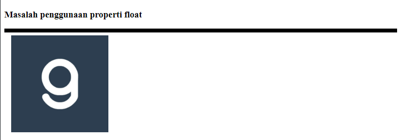
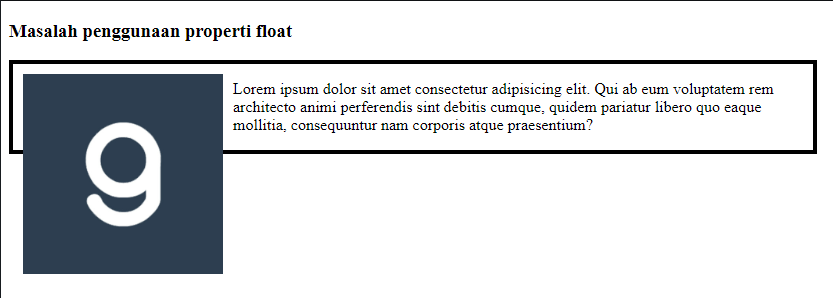
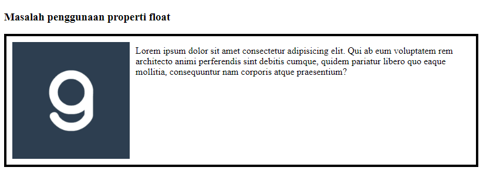

## Permasalahan penerapan float

Jika sebuah elemen induk hanya memiliki satu elemen dengan menerapkan properti float, ia akan memiliki nilai tinggi 0px. Contohnya seperti berikut:

```html
<!doctype html>
<html lang="en">
<head>
   <style>
       .container {
           width: 800px;
           border: 4px solid black;
       }
 
       img {
           float: left;
           margin: 10px;
       }
   </style>
</head>
<body>
<div class="container">
   
</div>
</body>
</html>
```

Ketika di buka di browser akan tampak seperti gambar dibawah:



Pada contoh tersebut kita bisa melihat bahwa elemen gambar berada di dalam sebuah container div. Tetapi container tersebut tidak memiliki tinggi senilai gambar yang ditampilkan. Mengapa bisa demikian? Untuk lebih jelasnya kita coba tambahkan paragraf di dalam container tersebut tanpa menggunakan properti float.

```html
<!DOCTYPE html>
<html lang="en">
<head>
    <meta charset="UTF-8">
    <meta http-equiv="X-UA-Compatible" content="IE=edge">
    <meta name="viewport" content="width=device-width, initial-scale=1.0">
    <title>Problem Floating</title>
    <style>
        .container {
            width: 800px;
            border: 4px solid black;
        }
    
        img {
            float: left;
            margin: 10px;
        }
    </style>
</head>
<body>
    <h3>Masalah penggunaan properti float</h3>
    <div class="container">
        
        <p>Lorem ipsum dolor sit amet consectetur adipisicing elit. Qui ab eum voluptatem rem architecto animi perferendis sint debitis cumque, quidem pariatur libero quo eaque mollitia, consequuntur nam corporis atque praesentium?</p>
    </div>
</body>
</html>
```

Hasilnya :



Hal ini menunjukkan bahwa elemen yang menerapkan float “tidak dianggap ada” oleh induk elemen yang menaunginya karena jika menggunakan float, elemen akan dikeluarkan dari normal flow.

### Bagaimana Cara Mengatasi Masalah Floating

Terdapat dua cara yang pertama, menggunakan properti clear dan kedua, menetapkan nilai overflow: auto pada container.


### Clear Property

Properti clear memang dibuat untuk menghilangkan sifat float, dengan demikian elemen yang menerapkan properti float akan kembali “dianggap ada”. Namun untuk menerapkan properti ini kita perlu membuat sebuah elemen kosong (biasanya menggunakan div tanpa konten) yang menerapkan properti clear.

```css
.clear {
    clear: left;
}
```

```html
<body>
    <h3>Masalah penggunaan properti float</h3>
    <div class="container">
        
        <p>Lorem ipsum dolor sit amet consectetur adipisicing elit. Qui ab eum voluptatem rem architecto animi perferendis sint debitis cumque, quidem pariatur libero quo eaque mollitia, consequuntur nam corporis atque praesentium?</p>
    <div class="clear"></div>
    </div>
</body>
```
Nanti hasilnya seperti dibawah ini:



>Note: jika terdapat dua elemen yang menerapkan nilai float berbeda (left dan right)?  Terdapat satu nilai lagi yang dapat menghilangkan kedua sifat float tersebut, yakni nilai `both`. 

### Overflow Property

Cara yang kedua adalah dengan menetapkan properti `overflow: auto;` pada elemen yang menampung elemen *float*. Sebagian *developer* lebih memilih menggunakan cara ini karena lebih praktis dan tidak perlu membuat elemen baru ketika menggunakannya.

Untuk menerapkannya sangatlah simpel. Cukup tambahkan properti *overflow* dengan nilai *auto* pada *container*.

```css
.container {
    width: 800px;
    border: 4px solid black;
    overflow: auto;
}
```

