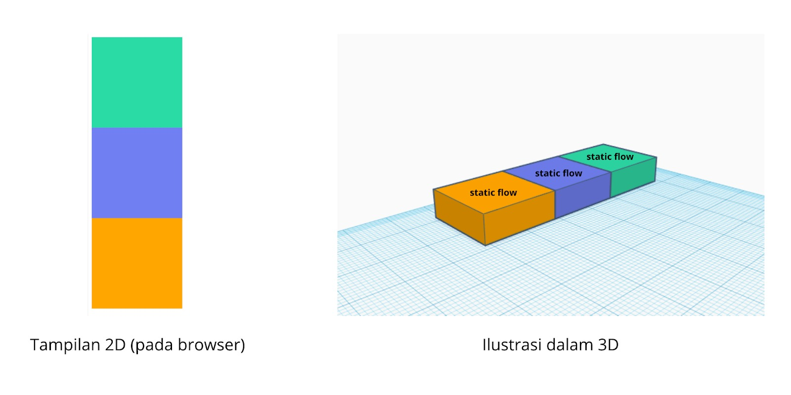
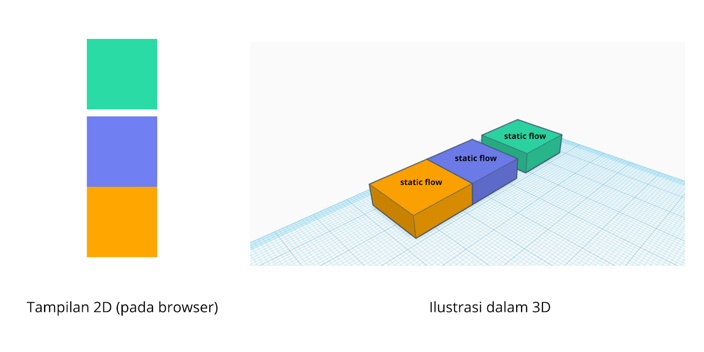
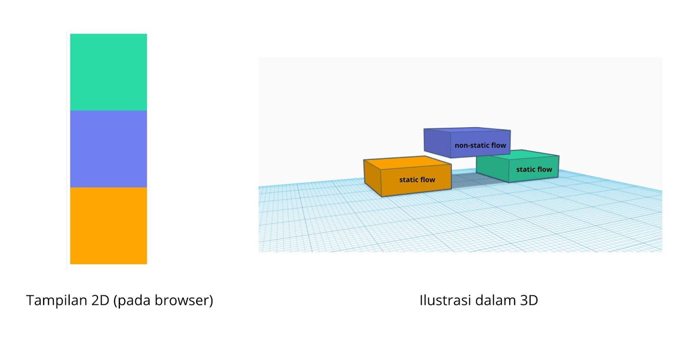
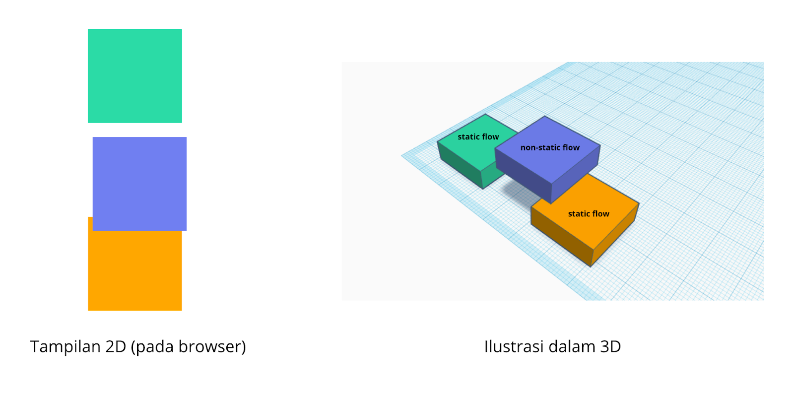

## Beda Static Flow dan Non Static FLow

CSS memiliki dua buah *flow* yang bisa digunakan untuk menampilkan elemen, yakni *static* dan *non-static*

Misalkan kita memiliki tiga buah elemen `<div>` yang berukuran 200px kali 200px (width dan height), berikut contohnya:

```css
.box {
    width: 200px;
    height: 200px;
}

.first {
   background-color: #60d0a8;
}
 
.second {
   background-color: #6495ed;
}
 
.third {
   background-color: #ffa500;
}
```

```html
<!DOCTYPE html>
<html lang="en">
<head>
    <meta charset="UTF-8">
    <meta http-equiv="X-UA-Compatible" content="IE=edge">
    <meta name="viewport" content="width=device-width, initial-scale=1.0">
    <title>Static Non Static Flow</title>
    <style>
        .box {
            width: 200px;
            height: 200px;
        }

        .first {
            background-color: #60d0a8;;
        }

        .second {
            background-color: #6495ed;
        }

        .third {
            background-color: #ffa500;
        }
    </style>
</head>
<body>
    <div class="box first"></div>
    <div class="box second"></div>
    <div class="box third"></div>
</body>
</html>
```

Karena kita tidak mengatur properti position dari ketiga elemen tersebut, maka tiap elemen akan ditampilkan dengan static flow seperti ini:



Ketika kita menambahkan pembatas pada kotak nomor dua dengan menambah properti `margin-top: 20px` akan mempengaruhi kotak nomor tiga

```css
.second {
    background-color: #6495ed;
    margin-top: 20px;
}
```



Pada ilustrasi di atas kita bisa lihat bahwa kotak yang berwarna oranye ikut bergeser ke bawah. Berbeda ketika kita menerapkan properti position yang dapat membuat elemen keluar dari static flow. Contohnya kita menerapkan properti position dengan nilai relatif.

```css
.second {
    background-color: #6495ed;
    position: relative;
}
```



Pada tampilan browser mungkin tidak terdapat perbedaan apapun setelah menerapkan nilai `relative` pada atribut `position`. Namun sebenarnya elemen yang menerapkannya akan diangkat dari luar *static flow* seperti yang ditampilkan pada ilustrasi 3D. Sehingga elemen tersebut dapat leluasa berpindah posisi tanpa mempengaruhi elemen yang berada pada *static flow*.

Untuk mengubah posisi elemen yang berada di *non-static flow*, kita dapat menggunakan properti `top`, `right`, `bottom`, maupun `left`.

```css
.second {
    background-color: #6495ed;
    position: relative;
    top: 30px;
    left: 10px;
}
```



>Note: properti `top`, `left`, `right`, dan `bottom` pada CSS hanya akan berpengaruh pada elemen yang menerapkan non-static flow (elemen yang menerapkan nilai `relative`, `absolute`, dan `fixed` pada properti position).


