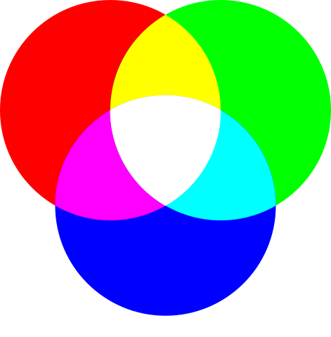

## Menetapkan Nilai Warna

Setiap warna pada layar komputer kita terdiri dari campuran warna merah, hijau, dan biru. Layar komputer dibuat dari ribuan kotak kecil yang biasa disebut pixel. Ketika layar monitor tidak menyala maka pixel pun tidak akan menyala. Ketika layar monitor menyala, tiap pixel dapat menghasilkan warna yang berbeda sehingga dapat menampilkan gambar.

Di dalam pixel terdapat tiga buah lampu kecil berwarna merah, hijau, dan biru. Ribuan warna dapat dihasilkan dari kombinasi tiga warna tersebut.



Untuk menentukan warna tertentu kita tidak harus menghapal kode warna dikarenakan ada ratusan kode, yang bisa kita lakukan adalah membuat kode warna dengan bantuan sofware gambar seperti photoshop, gimp dan lain-lain. Atau sekarang kita bisa menggunakan color picker secara online.

Untuk menetapkan nilai warna pada CSS kita dapat menggunakan Numeric Value dan Predefined Color Name. Apa sih maksud kedua hal tersebut? 

### Numeric Value

Cara yang paling banyak digunakan dalam menetapkan warna adalah  dengan menggunakan *numeric value*. Mengapa demikian? Dengan menggunakannya kita dapat menentukan warna yang kita inginkan dengan tepat. Terlebih dengan bantuan *color picker* maka kita tak perlu repot memahami dan mencari nilai kode warna secara manual.

Berikut contoh penulisan nilai warna pada CSS dengan numeric value

```css
/* Warna hijau menggunakan format RGB */
color: rgb(78,231,23);
 
/* Warna hijau Menggunakan format HEX */
color: #4ee717;
 
/* Warna hijau menggunakan format HSL (hanya di CSS3)*/
color: hsl(104, 82%, 50%);
```

Kode tersebut merupakan nilai warna hijau yang dituliskan dalam beberapa format. Dari kode tersebut kita tahu tidak hanya format RGB yang dapat digunakan dalam menetapkan warna. Selain RGB ada juga format Hex dan HSL (Hue, Saturation, Light).

### Predefined Color Name

Menentukan warna bisa juga dilakukan selain dengan menggunakan format angka. Kita bisa menggunakan sebuah kata seperti blue, yellow, red dan lainnya

```css
color: black;
color: white;
color: blue;
```

Dengan menggunakan kata tentu kita dapat lebih mudah dan cepat dalam menentukan warna, tetapi mungkin hanya warna dasar yang sudah kita hafal. Faktanya, varian warna ada banyak jumlahnya! Hampir seluruh browser saat ini mendukung 140 nama warna, wow! Kita dapat melihat apa saja warna yang tersedia pada tautan berikut: [Daftar Warna](https://www.w3schools.com/colors/colors_names.asp.)

### Opacity

CSS3 mengenalkan properti opacity yang dapat menspesifikasikan nilai transparan pada elemen HTML. Nilai dari properti opacity merupakan angka desimal antara 0.0 hingga 1.0, jika kita menetapkan nilainya 0.5 itu berarti 50% transparan.

```css
div#opacity {
   background-color: red;
   opacity: 0.5;
}
```

Selain pada elemen, menetapkan `opacity` juga dapat kita lakukan pada warna. Untuk melakukannya bisa menggunakan format *rgba*, dan *hsla*, di mana format ini merupakan format rgb ditambahkan nilai alpha. Selain itu, dapat juga dilakukan menggunakan format *hex* dengan memberikan dua digit dibelakang kode hexadecimal.

```css
p {
   color: rgba(78,231,23, 0.5);
   color: hsla(104, 82%, 50%, 0.5);
   color: #4ee717ee; /*ee merupakan digit tambahan untuk menerapkan opacity*/
}
```
