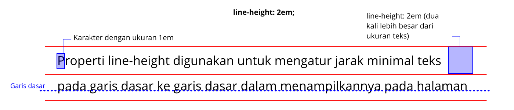

## Text Styling

Formatting pada keseluruhan teks yang ada pada baris paragraf, seperti menetapkan indent, jarak antar baris, kata dan huruf, dan sebagainya

### Line Height

Properti `line-height` digunakan untuk mengatur jarak minimal dari garis dasar ke garis dasar dalam menampilkannya teks pada halaman. Jika kita terbiasa dengan *software* document editor (rich text) seperti Microsoft Word, properti ini mirip dengan fungsi *line and paragraph spacing*.



Pada penjelasan diatas disebutkan *“minimal”*, karena jika terdapat sebuah karakter yang tinggi atau besar dalam sebuah baris, maka tinggi dari baris pun akan menyesuaikan agar jarak tetap mengakomodirnya.

Berikut merupakan contoh tiga cara berbeda dalam menerapkan tinggi baris dua kali lebih tinggi dari ukuran font:

```css
p {
    line-height: 2;
}

p {
    line-height: 200%;
}

p {
    line-height: 2em;
}

```

Cara pertama merupakan cara yang paling mudah digunakan, karena kita dapat menentukan nilai hanya dengan satu angka, di mana angka tersebut nantinya dikalikan dengan nilai `font-size` sebelum diterapkan pada nilai properti `line-height`. Contohnya, ukuran font standar pada paragraf adalah 16 pixel. Kita definisikan properti `line-height` dengan nilai 2, maka nilai properti `line-height` seharusnya adalah **16 pixel * 2 = 32 pixel (dua kali lebih besar dari ukuran font)**.

Properti `line-height` dapat diaplikasikan ke seluruh elemen yang ada pada HTML dan nilainya dapat diturunkan pada elemen turunannya.

### Text Indent

Dalam membuat sebuah dokumen tidak jarang kita membutuhkan jarak/lekuk di awal paragraf. Hal tersebut dapat dilakukan pada website dengan menerapkan properti `text-indent`.  Kita dapat menentukan nilai properti ini melalui perhitungan panjang dalam `px`, `em`, dan `in` atau bisa menggunakan nilai persentase (%). Nilai persentase dihitung berdasarkan lebar dari induk elemen. Berikut merupakan contoh penggunaannya:

```css
p#first {
    text-indent: 2em;
}

p#second {
    text-indent: 25%;
}

p#third {
    text-indent: -35px;
}
```

Pada contoh ke-tiga kita bisa melihat bahwa pada nilai properti ini dapat diberikan nilai negatif. Jika kita menggunakannya, maka baris pertama pada paragraf akan keluar dari batas elemen yang menampungnya (biasa disebut `hanging indent`). 

Perlu diingat kembali, properti ini hanya berpengaruh pada awal baris paragraf. Jika kita ingin menetapkannya untuk seluruh baris kita dapat gunakan `margin` atau `padding`, keduanya akan dibahas pada materi `box model`.

### Text Alignment

Kita bisa mengatur *text alignment* (perataan teks) pada website seperti kita melakukannya pada aplikasi Microsoft Word dengan menggunakan properti `text-align`. Untuk asalnya, properti ini bernilai left atau biasa kita sebut rata kiri. Namun jika kita ingin mengubah perataan teks ini berada di posisi lainnya, maka kita dapat mengubah value-nya menjadi value yang sesuai dengan keinginan kita.

Berikut ini nilai yang dapat digunakan pada properti `text-align`:

| Nilai Properti | Fungsi |
| -------------- | ------ |
| text-align: **left** | Mebuat perataan teks pada ujung kiri |
| text-align: **right** | Mebuat perataan teks pada ujung kanan |
| text-align: **center** | Mebuat perataan teks secara menengah |
| text-align: **justify** | Membuat perataan teks yang setara pada ujung kiri dan kanannya |

Berikut contoh penggunaan dari properti `text-align`:

```css
p#first {
    text-align: left;
}
 
p#second {
    text-align: right;
}
 
p#third {
    text-align: center;
}
 
p#fourth {
    text-align: justify;
}
```

