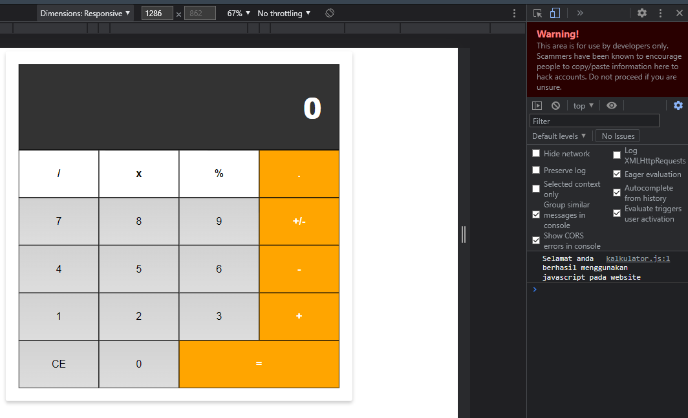

## JavaScript

JavaScript merupakan bahasa pemrograman client-side sehingga seluruh prosesnya berjalan pada sisi pengguna bukan server. JavaScript diperlukan pada pengembangan website ketika kita membutuhkan suatu interaksi dari pengguna. Sesungguhnya website hanya menampilkan konten yang statis jika hanya menggunakan HTML dan CSS.

Karena diolah pada sisi client, JavaScript sangat bergantung pada pengaturan dan kemampuan browser ketika melakukan sebuah proses (compiling atau rendering pada DOM). Bahkan pengguna dapat sepenuhnya tidak mengizinkan JavaScript berjalan pada browser dengan menonaktifkan dukungan JavaScript pada browser.

Sama seperti styling, untuk menggunakan JavaScript pada website kita bisa menerapkannya melalui atribut HTML, embed script, atau menggunakan file external.

### Atribut HTML

Untuk menuliskan JavaScript menggunakan atribut, kita bisa menerapkannya pada atribut event seperti “onclick”, sehingga JavaScript akan dieksekusi ketika elemen tersebut ditekan oleh kursor. Contohnya sebagai berikut:

```html
<button onclick="alert('Anda menekan elemen button')">Click disini!</button>
```

Ada banyak sekali atribut event yang dapat digunakan untuk menuliskan script di dalamnya. Kita bisa lihat apa saja atributnya pada tautan berikut: [Event Attribut](https://www.w3schools.com/tags/ref_eventattributes.asp)

Tentunya atribut tersebut kita gunakan sesuai dengan kebutuhan kita. `onclick` merupakan salah satu atribut yang common atau banyak digunakan karena interaksi tersebut sering pengguna lakukan.

### Embeded Script

JavaScript juga dapat dituliskan dengan menanamnya (embedding) pada berkas HTML dengan menggunakan elemen `<script>`.

```html
<script>
    // JavaScript dituliskan disini.
</script>
```

Elemen `<script>` dapat diletakan di dalam elemen `<head>` atau `<body>`. Akan tetapi jika kita menerapkan banyak script pada elemen `<head>` proses memuat halaman akan menjadi lambat, karena HTML akan membaca kode dari atas ke bawah.

### External Script

Metode lainnya yaitu dengan menggunakan berkas external yang berekstensi **.js**. Di dalam berkas tersebutlah seluruh JavaScript dituliskan. Keuntungan menggunakan metode ini adalah script dapat diterapkan pada berbagai berkas HTML tanpa menuliskan ulang scriptnya (keuntungan yang sama juga ketika kita menggunakan external css).

Untuk menghubungkan external script dengan berkas HTML, kita gunakan elemen `<script>` lalu tambahkan atribut `src` dengan nilai alamat berkas **.js** yang digunakan.

```html
<script src="berkas-javascript.js"></script>
```

Sama seperti Embedded Script, kita bisa tuliskan tag `<script>` tersebut di dalam elemen `<head>`. Namun, direkomendasikan untuk disimpan di dalam elemen `<body>` sebelum tag penutup `</body>`.

### Console Log

```html
<head>
    <meta charset="UTF-8">
    <meta http-equiv="X-UA-Compatible" content="IE=edge">
    <meta name="viewport" content="width=device-width, initial-scale=1.0">
    <title>JavaScript Dasar</title>
    <link rel="stylesheet" href="assets/style.css">
    <script src="assets/kalkulator.js"></script>
</head>
```

```javascript
console.log("Selamat kita sudah berhasil menjalankan javascript pada website");
```
Script yang kita tuliskan sebelumnya berfungsi untuk menampilkan sebuah data baik itu teks (string) atau variabel, objek, fungsi dsb. Pada console website  console.log() biasanya digunakan sebagai sarana debugging sederhana untuk mengetahui nilai dari suatu variabel.



### Statement

Sebuah *script* dibangun dari serangkaian *statement*. *Statement* merupakan sebuah perintah yang bertujuan untuk memberitahu apa yang harus dilakukan browser. Contohnya kode berikut merupakan *statement* yang menyatakan bahwa browser harus menampilkan pesan (*alert*) dengan kalimat “Terima kasih”.

```javascript
alert("Terimakasih");
```

### Komentar

Pada JavaScript juga terdapat fitur komentar. Seluruh teks yang dituliskan pada tanda komentar akan diabaikan (tidak dianggap ada) atau tidak akan dieksekusi. Dalam komentar ini kita bisa menuliskan teks untuk mengingatkan atau menjelaskan kode yang kita tuliskan. Hal ini bisa saja berguna jika kode yang kita tuliskan akan diubah oleh orang lain. Tapi ingat, jangan terlalu berupaya dalam menuliskan komentar yang sebenarnya tidak perlu dituliskan.

Ada dua tipe komentar
- Komentar diberikan satu baris `//`
- Komentar diberikan multi baris `/**/`

contoh komentar satu baris:

```javascript
// ini merupakan komentar satu baris komentar

// alert("Terima kasih");
```

contoh komentar multi baris :

```javascript
/* Ini merupakan komentar dengan lebih dari satu baris
Teks apapun yang berada disini akan dijadikan komentar.
Ketika menggunakan ini, jangan lupa untuk menutupnya.
*/
```

### Variable

>**Note:**Sebaiknya hindari penamaan variabel dengan istilah umum seperti `“data”`, Gunakanlah penamaan variabel yang dapat mendeskripsikan nilai dari variabel itu sendiri

Berikut beberapa aturan dalam penamaan variabel yang perlu Anda ketahui:

- Harus dimulai dengan huruf atau underscore (_).
- Dapat terdiri dari huruf, angka, dan underscore (_) dengan berbagai kombinasi.
- Tidak dapat mengandung spasi (white space), jika penamaan variabel lebih dari dua kata maka tuliskan secara camelCase. Contoh firstName, lastName, catName, dll.
- Tidak dapat mengandung karakter spesial (! . , / \ + * = dll.)

Nilai variabel yang diinisialisasi menggunakan `var` dapat diubah kembali nilainya, contoh:

```javascript
var firstName = "John";
console.log(firstName);

firstName = "Jane";
console.log(firstName);

/* output:
John
Jane
*/
```

Sejak ECMAScript 2015 (ES6) selain `var`, menginisialisasikan variabel dapat menggunakan `let` dan `const`. ES6 melakukan improvisasi pada deklarasi variabel karena menggunakan var terdapat beberapa hal yang kontroversial, salah satunya hoisting.

Apa itu hoisting? sesuai artinya “Mengangkat” variabel yang dideklarasikan menggunakan var ini dapat diberikan nilai terlebih dahulu sebelum dideklarasikan, Contoh:

```javascript
x = 100;
var x;
console.log(x);

// output : 100

/*Ini dikarenakan proses hoisting, sebenarnya di belakang layar deklarasi variabel x diangkat ke atas sehingga kode yang tampak seperti ini:*/

var x;
x = 100;
console.log(x);

// output : 100
```

Hoisting menjadi kontroversial karena tidak sedikit developer yang dibuat bingung akan hal ini. Masalah ini sudah terselesaikan jika kita menggunakan `let` dalam mendeklarasikan variabel.

```javascript
y = 100;
let y;
console.log(y);

/* ReferenceError: Cannot access 'y' before initialization */

let y = 100;
console.log(y);

// output: 100
```

Kemudian **`const`** digunakan untuk mendeklarasikan sebuah variabel yang sifatnya immutable atau tidak perlu diubah nilainya. Jika kita menginisialisasi kembali nilai variabel yang menggunakan `const`, maka akan mendapati eror “TypeError: Assignment to constant variable.”

```javascript
const z = 100;
console.log(z);

z = 200;
console.log(z)

/* TypeError: Assignment to constant variable. */
```

